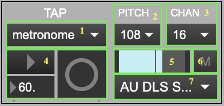
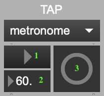
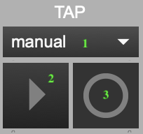
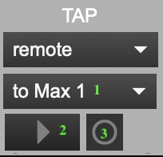
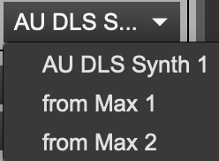

+++
title = "Beat Input"
alwaysopen = "false"
weight = 25
+++

## 2. BEAT INPUT

### Input Selector

Djazz plays a beat each time it receives a message (a "**tap**," or "**click**"), if it is engaged (how to engage Djazz will be explained below). When not engaged, it will not play when a beat message is received. When this is the case, you can click on **bars** or **chapters** ("cells" of the grid) in the song grid without triggering playback. Once engaged, djazz will begin playing on the next beat after a cell has been clicked on.

The cells of the grid change color depending on whether Djazz is engaged and whether a cell is currently playing or not. The colors represent the following:

- **Light gray**: not the current measure/chapter of the song  
- **Dark gray**: the current measure measure/chapter of the song, but Djazz is not engaged  
- **Blue**: the current measure measure/chapter of the song, but not playing  
- **Orange**: the current measure measure/chapter of the song, and playing  

There are three ways to send Djazz a beat message; you select one from the dropdown menu: **manual**, **metronome**, or **remote**.  Selecting from the dropdown menu will change the controls on the left side of this box. When one option is selected, the other two are not responsive.  
  

The right-hand side of the window lets you change the sound and output port of the click.

**1. INPUT SELECTOR**: Select if the input beat will come from one of the following: 
1. Djazz's metronome  
2. a manual tap from the user  
3. a remote source, such as another DAW.  

  

**2. OUTPUT CLICK MIDI PITCH**: Changes the pitch of the click. The number indicates the MIDI value of the pitch.

**3. OUTPUT CLICK MIDI CHANNEL**: The MIDI channel of the click (1-16).
**4. SELECTED INPUT VIEW**: [metronome](#metronome), [manual](#manual), or [remote](#remote).  

**5. OUTPUT CLICK VOLUME CONTROL**: The volume of the click. When muted, this will be gray.  
**6. OUTPUT CLICK MUTE BUTTON**: Mutes/unmutes the click  
**7. OUTPUT CLICK MIDI PORT**: The output port of the click.

## BEAT INPUT VIEWS
### Metronome
  
1. The button marked with a triangle turns the metronome on and off. When you turn this button on and then select a grid cell, the metronome will trigger a new beat each time it clicks, beginning with the beat represented by the grid cell. No beat will be triggered until a grid cell has been selected.
2. The number selector sets the metronome tempo. This is automatically set when a new song is loaded, but you can change it.
3. This flashes each time the metronome sends a beat.

### Manual

1. The triangle button engages Djazz.
2. Clicking on the circle button sends Djazz a beat message. You can also press the space bar to send a manual click.

**Djazz expects the starting tempo given in the song file!**

### Remote

This will send a beat message to Djazz every time a MIDI note on message is received (i.e., with a non-zero velocity) on any channel.
1. The dropdown menu selects the MIDI input port for the click.
2. The triangle button engages Djazz.
3. This flashes each time a beat is received.

 
