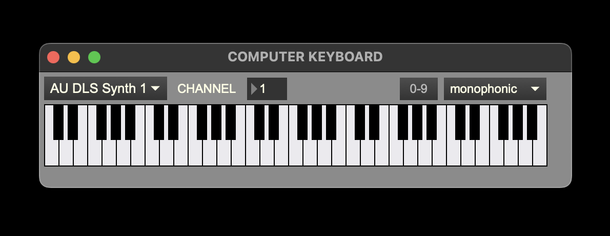

+++
title = "MIDI Input Selector"
alwaysopen = "false"
weight = 48
+++

### 1. MIDI Flush
This will clear any sounding MIDI output.
### 2. MIDI input port selection menu
### 3. Computer keyboard window open/close
When selected, the [computer keyboard window](#computer-keyboard-window) will open.
### 4. MIDI input monitor on/off
### 5. MIDI monitor output port selection menu
### 6. MIDI volume meter
When the monitor button is on, this will show the MIDI input volume level in green, orange, and red. When the monitor is off, it will be grey.

## Computer Keyboard Window

### 1. Output Port
### 2. MIDI Channel select
### 3. Number keys enable
When enabled, the computer keys 0-9 will play the MIDI values C3-D4.
### 4. Mode selection menu: select between monophonic and polyphonic mode
### 5. Keyboard
Click a key with the mouse to play it. If the mode selected is polyphonic, you must click the key again to stop it playing.