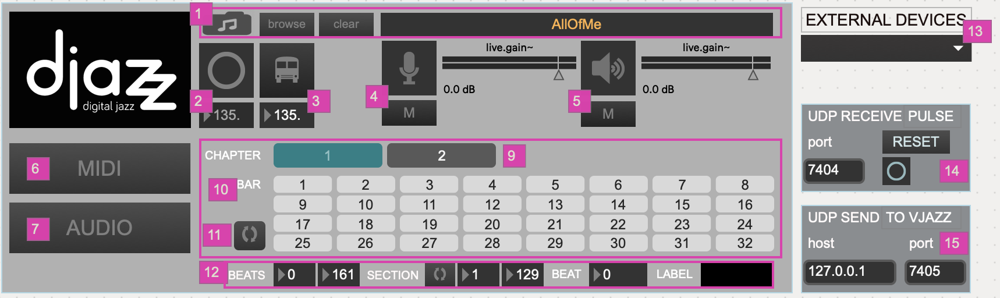
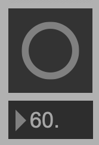
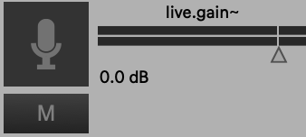
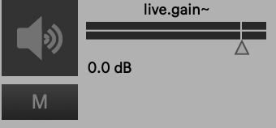
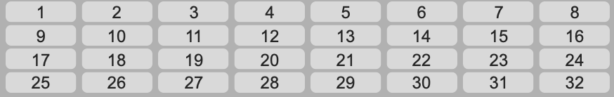

+++
title = "Main Window"
weight = 20
+++

### 1. SONG LOADING
#### Open a new song

## 2. BEAT INPUT
### Manual

### Metronome

### From another machine

## 3. GLOBAL AUDIO CONTROLS
### Audio In (Microphone)

### Audio Out (Speakers)

## 4. SONG GRID

### Chapter select

### Bar Select

### Loop Chapter Button

### Relation of Grid to beat input

## 5. PLAYBACK DATA VIEW

### Beats in song
### Beats in section (chapter)
### Section is looped
### Current beat
### Current beat label

## 6. MIDI UI SELECTOR

## 7. AUDIO UI SELECTOR
