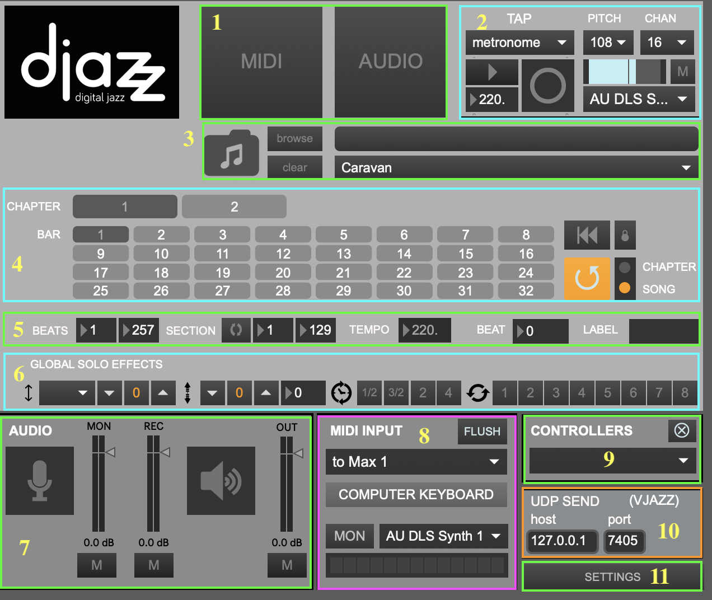
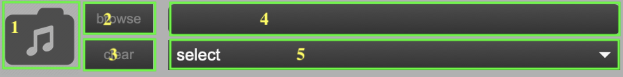
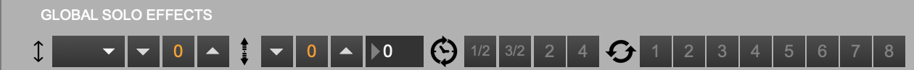
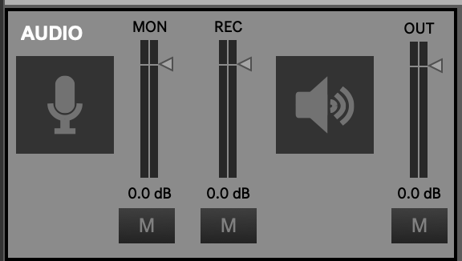
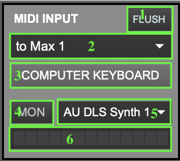
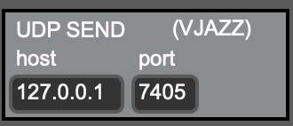

+++
alwaysopen = "false"
title = "Djazz Main Window"
weight = 20  
+++

## 1. MIDI/audio window selectors

Clicking on the button labeled "MIDI" or "Audio" will open and close the MIDI or audio interface window, respectively.  
You can also use the key commands "m" (lowercase) to open/close the MIDI window or "a" (lowercase) to open/close the audio window.

## 2. [Beat input window](2_beat_window_selector)

## 3. Song selector

To load a song grid, select a song using one of these controls. Songs are loaded by selecting _folders_, not individual files. Each folder contains various files pertaining to the song like scores and JSON metadata files.

1. Drag and drop a song folder here.
2. Browse for a song folder. To select a song, click on its folder.
3. Clear the current song.
4. Select a preloaded song from the dropdown menu.

## 4. [Song Grid](4_song_grid)

## 5. Data View

1. **BEATS**: total number of beats in the song 
2. **SECTION**: whether section is looped, and number of beats in current section
3. **TEMPO**: current tempo. Note: if the [beat input] comes from [Djazz's metronome](2_beat_window_selector#metronome) or a [remote metronome](2_beat_window_selector#remote), this will not change. If the beat input is [manual](2_beat_window_selector#manual), or if the remote source is a manual tap, this may fluctuate.
4. **BEAT** Number of current beat playing
5. **LABEL** Label of current beat playing, according to the loaded [song file](#3-song-selector)

## 5. PLAYBACK DATA VIEW

### Beats in song
When a song is loaded, this shows the first and last beat of the song.
### Section is looped

### Beats in section (chapter)
When a song is loaded, this shows the first and last beat of the current chapter.

# Tempo
This shows the current playback tempo. When the metronome is playing, this will be the same as (sometimes fluctuating extremely slightly from) the metronome tempo. When a manual tap 

### Current beat
### Current beat label

## 6. Global Effects

These effects are the same as the ones used in MIDI scores, MIDI tracks, and audio tracks. Changing a control in the global effects bar will change the corresponding effect in every one of these other effects bars.

## 7. GLOBAL AUDIO INPUT/OUTPUT
### Audio On
Clicking on either the microphone-icon button or the loudspeaker-icon button will turn the audio on.
### Audio In Level (Microphone)

Controls the level of the audio input. The button labeled "M" below the microphone-icon button mutes audio input.
### Audio Record Level
Controls the recorded volume level of the audio input.

### Audio Out (Speakers)
Controls the level of the global audio output. The button labeled "M" below the loudspeaker-icon button mutes audio output.

## 8. MIDI Input Window

## 9. External Controllers Selection Menu

## 10. UDP Send Port Select

## 11. Settings Window Open/Close Button

