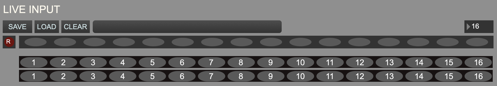

+++
title = "MIDI Live Input View"
weight = 10
+++

When clicked and illuminated, the record button arms the buffer for recording. It does not start recording until the first beat that advances the grid.

### 1. Save/Load/Clear Live Input Session
Save the current a MIDI live session. These sessions are saved as folders (see [saving and loading files]({{ .Page.Dir }})) containing
    - a MIDI file
    - a JSON file containing beat, note, label, and repetition metadata, so that this can be reloaded into a Live Input session. This is not the same format as [score files](), and will not load into the [score file loader]. 

### 2. Input Track Repetitions
Each oval in the track represents a repetition of the current looped section. When recording, each time the end of the section is reached, a new oval will illuminate.

### 3. Maximum Number of Repetitions 
This selects the maximum number of repetitions that can be recorded. The default is 16.

### 4. Output track repetitions
There are two MIDI live input tracks. They use MIDI outs are 1 and 2.  Ovals can be selected to be played if the corresponding input oval is illuminated.

