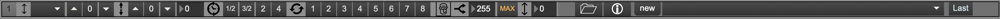

+++
title = "MIDI Scores View"
weight = 20
+++

### Score Player/Loader Window

MIDI scores are made up of multiple MIDI tracks. They are saved in a [special format](). When a score is loaded, the corresponding MIDI tracks will load. Effect controls in each score bar will change all the effects in the tracks belonging to the score.

Djazz uses two scores.
They correspond to the following tracks:

Score 1: Tracks 8-15
Score 2: Tracks 3-7

### Score Loader

Scores can be loaded by dragging a score onto the button with an icon of a folder. If a [song folder]() is loaded that contains scores in its **new** and **new2** subdirectories, these scores will be available in the dropdown menus. Choosing a score from the menu will load it.

