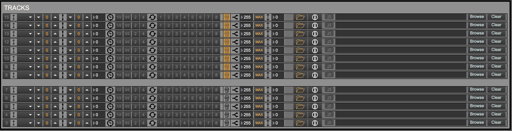

+++
title = "MIDI Tracks View"
weight = 40
+++

  

#### Track effects
  

#### File/track info select
#### Load MIDI track
  
You can load a track that does not follow the chord progression in the song file. If the track contains chords that are used in the song file, though, the [improviser]() will use this chord information to create a harmonically correct solo!

#### Track info view
  

