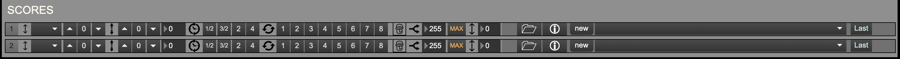

+++
title = "MIDI Window"
weight = 30
+++

### MIDI In View

When clicked and illuminated, the record button arms the buffer for recording. It does not start recording until the first beat that advances the grid.

### Recording MIDI
### Sending MIDI output to another machine
### Scores View

### Score Player/Loader Window

### Score Loader

### Pitch Transposition

#### Changes the pitch of the MIDI output

### Octave Transposition

#### Changes the octave of the MIDI output

### Speed

#### Changes the speed of the MIDI output

### Loop

#### Loops the previous <i>n</i> beats of the MIDI output

### "Jam" (Improvise)

### "Jam" Button

Turns the improviser on. When this is on, the MIDI track(s) is/are not played back straight, but beats are chosen based on the harmony and the next two controls, continuity and potch range:

### Continuity

This determines the length in beats that sections of the score will be played back in sequence. Once this many beats has been played in sequence, the improviser will jump to a new section of the score. 

The maximum coninuity is 255 beats. When the "MAX" button is on, this will be the continuity--i.e., the score will be played back without improvising, i.e. jumping around through it (given that the score is < 255 beats long. If you're using this with a score that's longer than 255 beats and you just want to play the score straight, there's no reason to be even using the improviser.)

The improviser tries to match beats that have the same harmony as the current beat. By adjusting the pitch range, it will look for beats with a similar chord type but with roots above or below the current chord root. A pitch range of <i>n</i> will look for chords between (and including) <i>n</i> semitones below and <i>n</i> semitones above the current chord root. Set to zero, it will match the chord root exactly. Beats with different roots will be transposed to the proper harmony.

### MIDI Out

### Solo Button

When illuminated, this will "solo" the MIDI track. If a single track is soloed, it is the only track that you will hear. If several MIDI tracks are soloed, only these tracks will be audible. If no tracks are soloed, all the tracks will be audible.

### Active Button

If not illuminated, the MIDI track will not be audible, and its volume in the volume meter will be gray. When illuminated, the MIDI track will be audible.

### Volume Dial

Changes the volume of the MIDI track. If you click just above the dial, the dial will reset to its default value of 80.

### Volume Meter
Shows the level of the MIDI output. When a track is inactive, this will be grey. When active, the output will be green, orange, and red, depending on the volume level.

### Channel Select
Allows the user to change the MIDI channel of track. Options are 1 through 16.

### Port Select
Allows the user to select the output port of the MIDI track. These are usually Max's internal MIDI playback (which will be called something like "DAC synth"), and outputs to other applications (called "from Max 1" and "from Max 2").

### Global Port Select
This changes the output port of all the MIDI channels.

