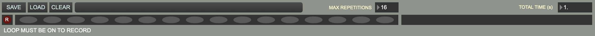

+++
title = "Live Input"
weight = 10
+++

  

These controls are similar to the [audio live input]() controls.

When clicked and illuminated, the record button arms the buffer for recording. It does not start recording until the first beat that advances the grid.

### 1. Save/Load/Clear Live Input Session
Save the current a audio live session. These sessions are saved as folders (see [saving and loading files]({{ .Page.Dir }})) containing
    - an audio file in WAV format
    - a JSON file containing beat, note, label, and repetition metadata, so that this can be reloaded into a Live Input session.

**Note**: to save and load an audio file, you actually save and load a <i>folder</i>. Just name the folder in the dialog window, and the folder will be created and appropriately named files (.wav and .json) will be saved in the folder. For loading, choose the folder from the dialog.

### 2. Input Track Repetitions
Each oval in the track represents a repetition of the current looped section. When recording, each time the end of the section is reached, a new oval will illuminate.

### 3. Maximum Number of Repetitions 
This selects the maximum number of repetitions that can be recorded. The default is 16.

### 4. Output track repetitions
There are two audio live input tracks. They use audio outs are 1 and 2.  Ovals can be selected to be played if the corresponding input oval is illuminated.