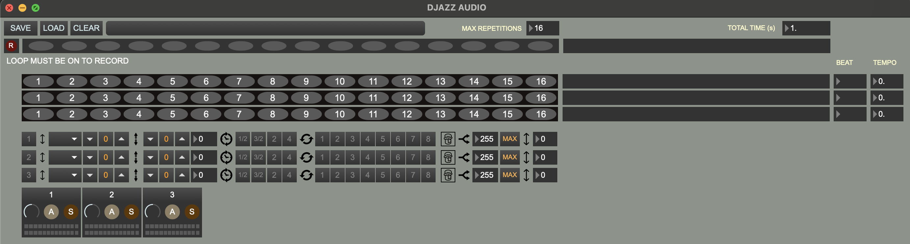

+++
title = "Audio Window"
weight = 40
+++

  

# 7. AUDIO UI

### [Audio Live Input](1_live_input)

## Audio Track
#### Playback & Improvising -- see Midi Track

##### Volume dial and reset click
##### Mute

## Audio Out
### Audio Out Track
### Volume dial and reset click
### Solo
### Mute
### Volume meter

6. Il y a un patch pour extraire les données de la grille des partitions audio textuelles comme celles que vous avez envoyées vers le nouveau format :

patchers/data_file_makers/text_score_to_audio_grid_data.maxpat