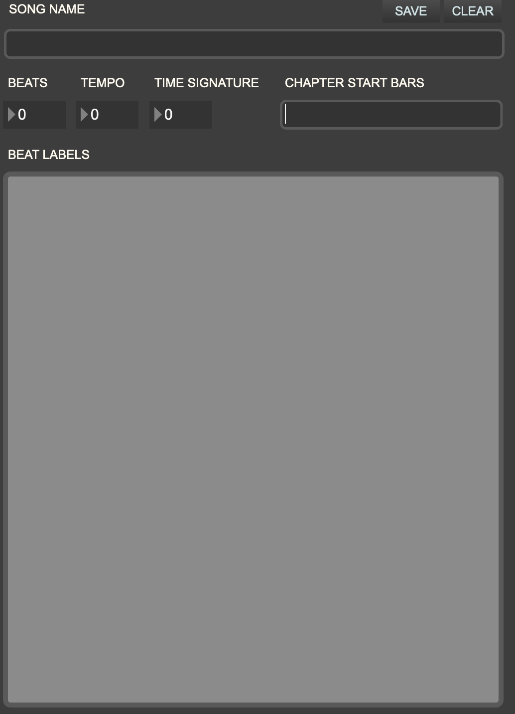
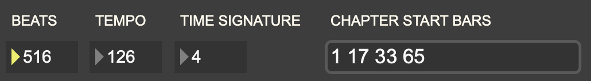
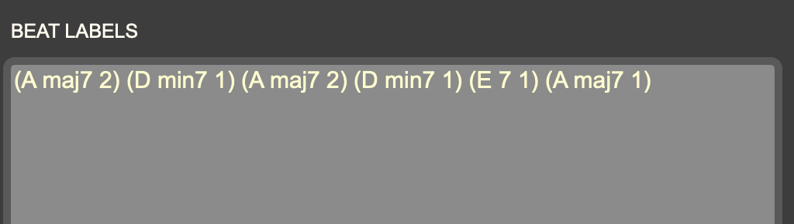
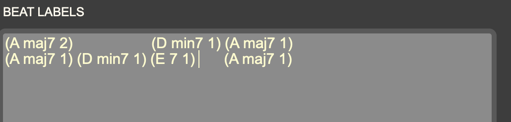

+++
title = "Making a Song File"
weight = 10
+++

Djazz uses a _song file_ to play a song, whether you are plaing back scores or using live MIDI or audio. Where a _score file_ contains the notes in each beat of the song, a _song file_ contains all the metadata for each beat: its label, its position in the song, and what chapter of the song it is in.
Djazz uses labels that represent chords. In this way, a _song file_ is like a chord chart.

To create a _song file_ for a new song you want to play with Djazz, the __make_song_file__ Max patcher is provided for you in the _tools_ folder.

### SONG NAME
Enter the name of the given song; this will be displayed when the song file is loaded, and will also appear in the song dropdown menu if it is placed in the _djazz_user/scores/_ folder

### BEATS
Enter here the total number of beats in the song.

### TEMPO
Enter the song tempo. This tempo will be loaded into Djazz's metronome when the song is loaded, and is also the tempo that will be expected if [manual tap entry is performed](1_manual/1_installation/index.md)

### TIME SIGNATURE
Enter the number of beats per measure, i.e. the top number in the time signature. The duration of the beats, i.e. the bottom number in the time signature (4 for quarter note, 8 for eighth note, etc.) does not matter; do not include it.

### CHAPTER START BARS
If the song is divided into chapters, enter here the bar (i.e. measure) numbers at which the chapters begin.
For instance, if a song contains four chapters of 16, 16, 32, and 64 bars, in that order, the chapter start bars will be 1, 17, 33, and 65. Enter these numbers without commas

Putting all this together, here's what you would enter for a song in 4/4 time, with chapters of duration as above: 16, 16, 32, and 32 bars. The number of beats is the total number of bars multiplied by the time signature; in this case (16 + 16 + 32 + 64) * 4 = 128 * 4 = 516

### BEAT LABELS

Beat labels are input in a text-based format. They can be entered directly into the tool's window, or cut and pasted from a text editor.

A chord label has two parts, the _root_ and the _quality_. The way of entering labels is as follows:

&emsp; (\< _chord root_ \> &emsp; \< _chord quality_ \> &emsp; \< _number of consecutive beats_ \>)

\< _chord root_ \> can be the symbol C, C#, Db, D, D#, Eb, E, F, F#, Gb, G, G#, Ab, A, A#, Bb, or B.

\< _chord quality_ \> can be any symbol that does not contain an underscore ("_") or a semicolon(";").  

The improvisation algorithm
functions in part by matching these symbols with the symbols on the beats in score files, so if you want it to work correctly, keep the format of these symbols the same. For instance, the preloaded songs in Djazz use the following symbols:

&emsp; _maj7, min7, 7, dim7, maj6, min6_

But you can define any symbols you want:

&emsp; _dom7#9b9#11, maj6add9, min6withanextraweirdnoteatthetop_, etc.

\< _number of consecutive beats_ \> is how many beats this particular label is repeated.

So for instance, the chord sequence  

&emsp; Amaj7 &ensp; Amaj7 &ensp; Dmin7 &ensp; Amaj7  
&emsp; Amaj7 &ensp; Dmin7 &ensp; E7 &emsp; &nbsp; &nbsp; Amaj7

would be entered as

It could also be entered as

if this is easier to read.  
Indentation and carriage returns are ignored by the tool.

HOW TO MAKE A NEW SONG FILE FOR DJAZZ.

A song file is not a score file. It does not contain any notes to play. It contains the navigation information in the song: chapters, bars, beats chord labels, and tempo, in order to make the grid and send the master clock and factor oracle the appropriate data.

Here is how to make one. There are seven (7) steps listed below.

1. Open the patcher “djazz.make_song_file.maxpat” from the folder “patchers/data_conversion_tools” in the current djazz folder.

2. In the appropriate fields, put in the song name, beat count, tempo, time signature, and the starting bars for each chapter. This data is exactly the same, and in the same order, as the data listed for the songs in the old Djazz version, EXCEPT FOR ONE DIFFERENCE: don’t use quotation marks when you put in the start bars. Only put in the list of numbers (and don’t use commas).

3. Put the grid data in the “grid data” box. Put it in (or copy and paste it) in LISP-style notation, where each entry is a list:  ( chord-root   chord-type-symbol   number-of-measures  )
Do not use outer parentheses for the whole list of lists.
Do not include any comments or semi-colons.
Spacing and indentation is not important.

4. Press the “save” button.

5. Save the song file in the folder of the same song name that contains the subfolders “new” and “new2.” The file name and the song folder name should be exactly the same.



6. That’s all. If the folder you put the new song file in has scores in its “new” and “new2” subfolders, this song can now be played as usual by Djazz.

7. Press the “clear” button to clear the data.